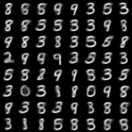
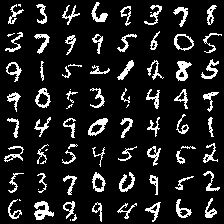
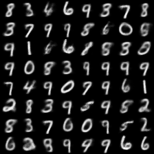

## Variational Autoencoders in Julia [still in progress, do not use it]

Personal implementation of the paper *"AutoEncoding Variational Bayes" by Kingma, D. P., & Welling, M. (2013)* in Julia.
I wanted to explore Julia programming language (after having used it in a course) and I tried to implement VAEs using it.

I tried to run it more than once, but it always stops because of a NaN loss. I used a latent space of dimension 3 and every MLP has one hidden layer with 400 hidden units.
In the following I report some samples from the prior and some reconstructions:

### Samples from the prior distribution at epoch 78

### Reconstructions at epoch 78

TODO: this is far from being a complete repo with optimized and working code. There are some problems I want to solve during my free time:
1. The code works well, reaching the same performance of the Pytorch implementation, using
the analytical KL, before getting NaN parameters (like after ~75 epochs). It is also much slower compare to the Pytorch implementation, therefore I expect that there is something not-well implemented in my code. Moreover, if we try to approximate the KL with samples it won't converge. I am trying to figure out the two problems. If you get into this code and find a solution feel free to open an issue :)
